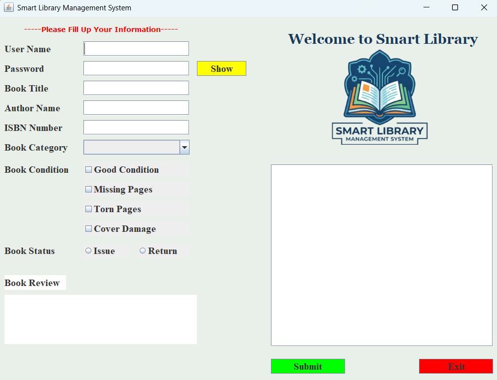

## Smart Library Management System
### Description:
A Java-based smart library management system developed using Object-Oriented Programming (OOP) principles and file handling. This application helps users manage library activities efficiently through an interactive and user-friendly desktop interface.

-----

### Home Page Preview:


### Features:
- User information management,
- Password visibility toggle,
- Book category selection,
- Book condition tracking,
- Book issue & return system,
- Review/Comment section,
- File handling for data storage,
- Interactive GUI using Java Swing,
- Real-time Information Display.

-----

### Technologies Used:
- Java,
- Object-Oriented Programming (OOP) principles,
- Java Swing (GUI),
- File handling.

-----

### Project Structure:
```bash
Smart-Library-Management-System/
│
├── frame/
│   └── framesample.java
│
├── entity/
│   └── library.java
│
├── Data/
│   └── userdata.txt
│
├── picture/
│   └── logo.png
│
├── start.java
│
├── README.md
│
└── LICENSE
```

-----

### How to Run:
1. Clone the repository:
   ```bash
   git clone https://github.com/tanafiz/library-management-system.git
   ```
2. Open the project in any Java IDE
3. Compile and Run: 
   javac start.java && java start

-----

### Functionalities:
- Add and manage book information,
- Select different book categories,
- Track book conditions,
- Issue books,
- Return books,
- Store transaction records,
- Save information using data files,
- Read and display stored data dynamically.


### Developed by T. A. Nafiz

-----
